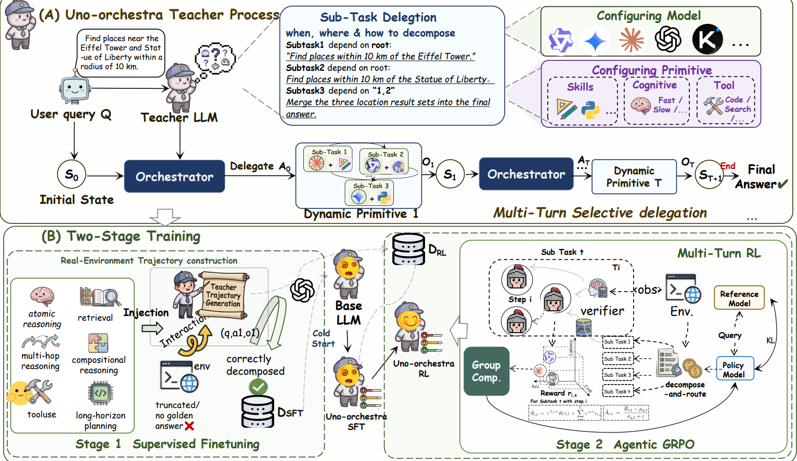

# Uno-Orchestra: Parsimonious Agent Routing via Selective Delegation

A unified causal-LM orchestrator that jointly learns task decomposition and per-subtask (model, primitive) routing under a cost budget.

## Status

**The model and code are coming soon** — training scripts, evaluation harness, curated data, and checkpoints will appear in this repo after the camera-ready release.

## Method overview

