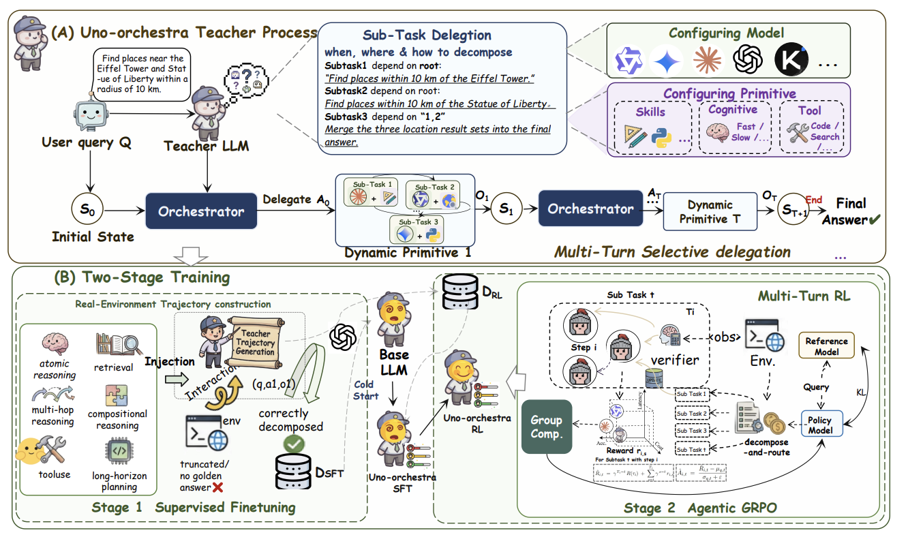
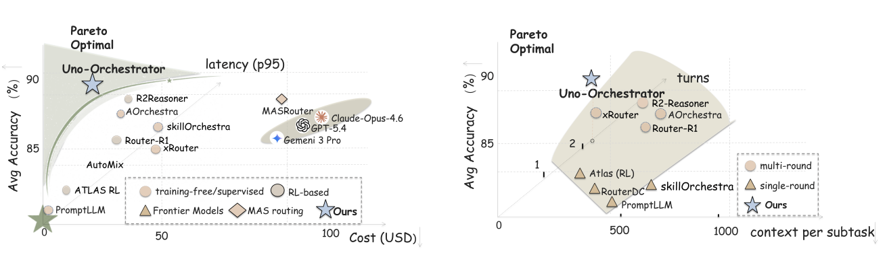
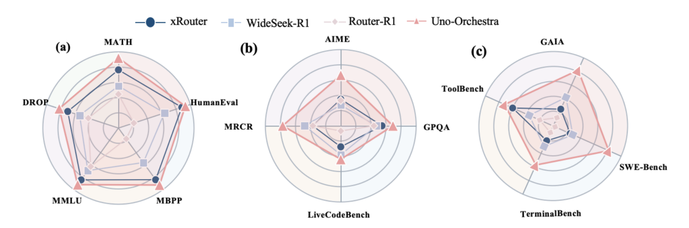
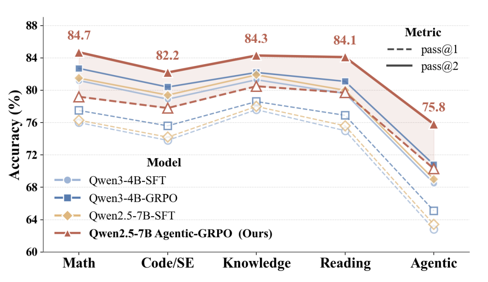

# Uno-Orchestra

**Official codebase for the paper
[Uno-Orchestra: Parsimonious Agent Routing via Selective Delegation](https://arxiv.org/html/2605.05007v1).**

[](https://arxiv.org/html/2605.05007v1)
[](https://huggingface.co/datasets/tinaxie/Uno-Curriculum)
[](https://github.com/CuiZHIQ/Uno-Orchestra)
[](LICENSE)

## Overview

Large language model systems increasingly rely on heterogeneous workers:
frontier models, economical models, code specialists, retrieval tools, and
execution sandboxes. A fixed router wastes budget on easy tasks, while a
hand-engineered planner separates *what to decompose* from *where to route*.

**Uno-Orchestra** treats orchestration as one learned causal-LM policy. Given a
task, the policy chooses between a direct answer and selective delegation. When
delegating, it emits a subtask plan and a `(worker model, primitive)` routing
decision in the same assistant turn. Worker observations flow back into the
policy, enabling repair, re-routing, and final answer synthesis under an
explicit cost budget.

<p align="center">
  
</p>

This repository packages the evaluation harness, routing runtime, RL
environment, and reproducibility scripts used to study selective delegation on a
13-benchmark suite spanning math, code, knowledge, long-context reasoning, and
agentic tool use.

## Highlights

- **Unified orchestration policy.** One policy model emits `<plan>`, `<route>`,
  `<obs>`, `<verify>`, and `<final_answer>` trajectories.
- **Closed worker/primitive pool.** Worker models, admissible skills, and token
  prices are configured in [configs/pools.yaml](configs/pools.yaml).
- **Real worker interaction.** Routed calls execute through a shared harness
  with local primitives, worker LLM calls, Docker executors, and benchmark
  verifiers.
- **Paper-style evaluation.** The runner reports `pass@1`, `pass@2`, 5-domain
  macro, 13-benchmark macro, context tokens, output tokens, and USD/query.
- **Two complete scoring modes.** Official-compatible verifier flow and
  multi-turn Uno harness flow are both recorded in every `summary.json`.
- **OpenAI-compatible deployment.** The local policy and worker pool can be
  served by vLLM, LiteLLM, or any compatible `/v1/chat/completions` gateway.

## Experimental Snapshot

The paper evaluates Uno-Orchestra against 22 baselines on the same
13-benchmark suite implemented here, reporting the accuracy-efficiency frontier
with `pass@1`, `pass@2`, context tokens, and USD/query.

<p align="center">
  
</p>

<p align="center">
  
</p>

<p align="center">
  
</p>

## Repository Layout

The repository is organized around the pieces that are specific to
Uno-Orchestra. The vendored `verl/` tree is kept for RL training support.

```text
.
|-- uno_orchestor/
|   |-- routing/uno/              # route schema, primitive pool, harness, backends
|   `-- agents/                   # Docker-capable sub-agent executor
|-- env/
|   `-- env_package/uno/          # Uno RL/eval environment and verifiers
|-- eval_pipeline/
|   |-- benchmarks/               # 13 benchmark adapters
|   |-- routers/                  # direct, random, oracle, Uno policy routers
|   |-- executors/                # Docker, SWE-bench, Terminal-Bench executors
|   `-- run.py                    # main evaluation entrypoint
|-- configs/
|   |-- pools.yaml                # worker model pool, primitives, prices
|   |-- uno/system_prompt.txt     # default Uno schema prompt
|   |-- litellm.example.yaml      # worker gateway template
|   `-- rl/                       # RL launch configs
|-- scripts/
|   |-- run_full_eval.sh          # full 13-benchmark evaluation matrix
|   |-- run_smoke_eval.sh         # one-task smoke evaluation
|   |-- check_eval_env.py         # environment preflight checks
|   `-- collect_results.py        # paper-style result aggregation
|-- examples/
|   `-- run_gpqa_smoke.sh         # minimal copyable evaluation example
`-- verl/                         # vendored veRL training framework
```

## 1. Environment Setup

Use Python 3.10+.

```bash
git clone https://github.com/CuiZHIQ/Uno-Orchestra.git
cd Uno-Orchestra

python -m venv .venv
source .venv/bin/activate
pip install -U pip
pip install -e '.[eval]'
```

Optional extras:

```bash
# Docker benchmarks: SWE-bench and Terminal-Bench
pip install -e '.[eval,docker]'

# Local policy serving with vLLM
pip install -e '.[serve]'

# Multi-provider worker gateway with LiteLLM
pip install -e '.[gateway]'
```

Copy the environment template:

```bash
cp .env.example .env
```

Core variables:

```bash
LOCAL_BASE=http://localhost:8000/v1
LOCAL_MODEL=Qwen/Qwen2.5-7B-Instruct
API_BASE=http://localhost:9000/v1
API_KEY=EMPTY
PASS_K=2
```

`LOCAL_BASE` serves the Uno policy/router checkpoint. `API_BASE` serves the
worker model pool from [configs/pools.yaml](configs/pools.yaml).

### Local Policy Server

Example with vLLM:

```bash
python -m vllm.entrypoints.openai.api_server \
  --host 0.0.0.0 \
  --port 8000 \
  --model Qwen/Qwen2.5-7B-Instruct \
  --served-model-name Qwen/Qwen2.5-7B-Instruct
```

For an SFT/RL checkpoint, replace `--model` and `LOCAL_MODEL` with the
checkpoint path or served model name.

### Worker Gateway

The worker gateway can be LiteLLM, vLLM, or an internal OpenAI-compatible model
gateway. A LiteLLM template is provided:

```bash
litellm --config configs/litellm.example.yaml --host 0.0.0.0 --port 9000
```

The gateway must accept the worker ids declared in `configs/pools.yaml`.

### Preflight Checks

```bash
# Python packages and model endpoints
python scripts/check_eval_env.py

# Docker, SWE-bench, Terminal-Bench paths
python scripts/check_eval_env.py --docker

# Representative Hugging Face datasets
python scripts/check_eval_env.py --datasets --skip-endpoints
```

More details are in
[docs/evaluation_environment.md](docs/evaluation_environment.md).

## 2. Uno Routing Runtime

The policy emits a compact XML-like trajectory:

```xml
<plan round="1">
<subtask id="1" depends_on="">solve a focused subproblem</subtask>
</plan>
<route round="1" subtask="1" model="gemini-3-flash-preview" skill="reason">
worker-facing query
</route>
```

The harness validates the `(model, primitive)` pair, executes the primitive, and
returns:

```xml
<obs subtask="1">worker observation</obs>
```

The policy may route again, repair, verify, or terminate:

```xml
<verify round="2" status="satisfied">brief verification</verify>
<final_answer>answer</final_answer>
```

Supported primitive families include direct answering, reasoning, document
reading, code reading, structured extraction, Python execution, shell execution,
symbolic math, retrieval-style calls, and API-style calls.

## 3. Evaluation

The full evaluation suite contains 13 benchmarks across five domains.

| Domain | Benchmarks |
| --- | --- |
| Math | MATH-500, AIME |
| Code / software engineering | HumanEval, MBPP, LiveCodeBench, SWE-bench |
| Knowledge / scientific reasoning | MMLU, GPQA |
| Reading / long context | DROP, MRCR |
| Agentic / tool use | GAIA, Terminal-Bench, ToolBench |

Two scoring modes are recorded in every run:

| Mode | Score name | Benchmarks |
| --- | --- | --- |
| `official_compatible` | Official-compatible score | SWE-bench one-shot, HumanEval, MBPP, LiveCodeBench, MMLU, GPQA, MATH-500, AIME, DROP |
| `uno_harness` | Uno harness score | SWE-bench interactive, Terminal-Bench, GAIA, ToolBench, MRCR |

Run a one-task smoke evaluation:

```bash
bash examples/run_gpqa_smoke.sh
```

Run the full paper-style matrix:

```bash
PASS_K=2 bash scripts/run_full_eval.sh
```

Run selected benchmarks:

```bash
bash scripts/run_full_eval.sh --bench gpqa,mmlu,math500
```

Collect model-level metrics:

```bash
python scripts/collect_results.py --root data/eval --format md
```

JSON and CSV outputs are also supported:

```bash
python scripts/collect_results.py --root data/eval --format json
python scripts/collect_results.py --root data/eval --format csv
```

Each benchmark run writes:

```text
data/eval/<model_name>/<benchmark>/
  predictions.jsonl
  verification.jsonl
  summary.json
  logs/
```

`summary.json` includes router name, benchmark name, scoring mode, pass@1,
pass@2, route counts, model/skill/backend usage, context tokens, output tokens,
and USD/query.

## 4. Training and RL Components

The repository includes the Uno environment and reward integration for SFT/RL
experiments:

```text
env/env_package/uno/              # multi-turn rollout environment
uno_orchestor/routing/uno/        # route harness and primitive backends
scripts/rl/                       # Uno rollout and reward manager
configs/rl/                       # GRPO launch configs
verl/                             # vendored veRL backend
```

The evaluation framework can be used independently as long as a trained policy
checkpoint is served through `LOCAL_BASE`.

## 5. Examples

The minimal example is:

```bash
bash examples/run_gpqa_smoke.sh
```

It evaluates one GPQA sample through the Uno router and aggregates the output
under `data/eval/examples/gpqa_smoke`.

## 6. Notes for Reproduction

- The default worker pool contains heterogeneous commercial and local worker
  ids. Adapt `configs/pools.yaml` to the workers exposed by your gateway.
- SWE-bench and Terminal-Bench require Docker.
- Terminal-Bench tasks should be placed under `data/terminal-bench/tasks` or
  configured with `TERMINAL_BENCH_TASKS_DIR`.
- The default Uno schema prompt is
  [configs/uno/system_prompt.txt](configs/uno/system_prompt.txt). Override it
  with `UNO_SYSTEM_PROMPT=/path/to/prompt.txt`.
## Citation

If you use this repository, please cite:

```bibtex
@article{cui2026unoorchestra,
  title   = {Uno-Orchestra: Parsimonious Agent Routing via Selective Delegation},
  author  = {Cui, Zhiqing and Xie, Haotong and Yuan, Jiahao and
             Yang, Cheng and Wang, Hanqing and Wu, Yuxin and Wu, Yifan and
             Zhong, Siru and Yu, Tao and Guo, Yifu and Zhang, Siyu and
             Yu, Xinlei and Ren, Qibing and Naseem, Usman},
  journal = {arXiv preprint arXiv:2605.05007},
  year    = {2026},
  url     = {https://arxiv.org/html/2605.05007v1}
}
```

Paper: <https://arxiv.org/html/2605.05007v1>

## License

This repository is released for research use under the Apache-2.0 license. The
vendored `verl/` tree and external benchmarks, datasets, model weights, and APIs
remain under their respective licenses.
